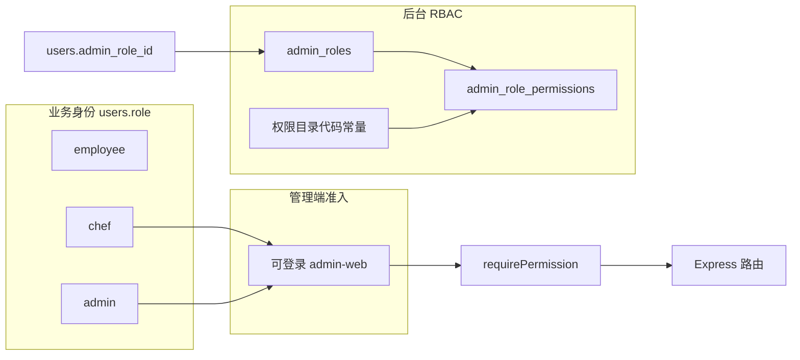

# 管理端权限管理（RBAC）设计方案

本文合并原「管理端_rbac_权限_350d9561」实施说明与后续设计评估（多角色并集、超级管理员锁权）。

## 现状与目标边界（与仓库对齐）

**数据与认证**

- [server/src/db/init.js](../server/src/db/init.js)：`users.role` 为 `ENUM('employee','chef','admin')`。
- JWT：在 [authController.js](../server/src/controllers/authController.js) 签发 `{ id, username, role, company_id }`（实施时保持 JWT 精简、权限服务端解析）。

**管理端入口**

- [admin-web/src/App.tsx](../admin-web/src/App.tsx)：仅允许 `admin`/`chef` 进入布局。
- [admin-web/src/components/AppLayout.tsx](../admin-web/src/components/AppLayout.tsx)：`user.role === 'admin'` 切换两套侧栏菜单。

**接口层**

- [server/src/middlewares/auth.js](../server/src/middlewares/auth.js)：`authorize('admin'|'chef')`。
- 部分 controller 内按 `req.user.role` 分支（如 [orderController.js](../server/src/controllers/orderController.js) 的 `updateOrderStatus`）。

### 设计边界（推荐）

1. **`users.role` 保留为「业务身份 / 客户端准入」**：`employee` = 产品「**用户**」（默认新建）；`chef` / `admin` = 允许登录**管理端**的升级身份。小程序点餐以 **`employee` 路径或等价「已认证点餐用户」规则**为准，**与后台 `admin_role_id` 解耦**。**首版不把该字段改成多态 RBAC**，避免波及小程序与现有同步接口。
2. **新增「后台角色」**：仅对能登录管理端的账号生效，用于模块可见 + 操作粒度；与业务身份**组合**：先满足「可进后台」，再校验「具体权限点」。
3. 若未来需要「员工也能看某只读报表」，再扩展准入规则；**首版不展开**。

### 人员类型（产品）与 `users.role`：你在说什么、库里是什么

**你的设计是否合理**  
**合理。**把人员分成 **用户（最基础）→ 厨师 → 管理员** 三档，是常见做法：多数人只点餐；少数人要厨房/后台操作；更少的人做系统配置。和「默认新建 = 用户」也一致。

**和数据库的关系（避免混淆）**  
表里只有一个字段表示「这个人是哪一类」，类型是 `ENUM('employee','chef','admin')`。三个取值**一一对应**产品上的三档，只是**英文命名是历史遗留**：

| 产品说法（中文） | 数据库当前取值 | 说明 |
|------------------|----------------|------|
| **用户**（最基本，默认新建） | `employee` | 代码/库里叫 employee，含义就是「普通账号 / 主要用来小程序点餐」，**不是**另一个独立体系。 |
| **厨师** | `chef` | 可登管理端（及小程序等按你们规则）。 |
| **管理员** | `admin` | 可登管理端。 |

所以：**没有**在库里再单独建一个叫 `user` 的字面量，并不等于「没有用户这个角色」——**`employee` 就是「用户」这一档在库里的名字**。若你希望界面、文档、接口对外都显示「用户」，可以在**展示层**统一把 `employee` 显示成「用户」，不必改库。  
若你坚持**数据库枚举字面量也要叫 `user`**，可以，但属于**重命名迁移**（改 ENUM + 全项目/SQL/小程序联调），计划里仍放在「可选确认」。

**和「后台岗位」的区别（再强调一句）**  
上面的 **用户 / 厨师 / 管理员** 是 **`users.role`（人员大类 + 能否进管理端）**；**后台岗位**（`admin_roles` / `admin_role_id`）是**进了管理端之后**能点哪些菜单、调哪些接口——多一层细粒度，两套不要混称成一个「角色」。

### 产品用语与数据对象对应（避免歧义）

- **岗位**（产品）= 数据表 **`admin_roles` 中的一条记录**（实现层可仍称 Role）；超管在「权限管理」里增删改岗位。
- **为岗位添加人员** = 给用户绑定 **`users.admin_role_id`**（同一用户同一时刻一个岗位，与首版单角色一致）。
- **模块范围 + 每模块操作** = **`admin_role_permissions`** 中的 `permission_key` 集合，与代码中的权限目录一一对应。
- **「用户」（产品 / 小程序点餐侧）**：与「后台岗位」**不是同一套概念**。实现上对应 **`users.role = 'employee'`**（即上表「用户」）；**新建用户默认即为该身份**。管理端 **`admin_roles` / `admin_role_id`** 仅描述**后台**能做什么，**不得**替代或覆盖小程序点餐身份语义。

---

## 已定产品决策（2026-05 业主确认）

以下为实现与验收的硬约束，已取代文中与之矛盾的「可选确认」表述。

1. **权限管理模块**：**仅超级管理员**可见、可进（前端菜单 + 后端 `/admin/rbac/*` 及绑定岗位的写接口）。**其余任何角色（含系统管理员、厨师岗等）均不包含权限管理入口与接口授权。**
2. **超级管理员在权限管理内做的事**：维护**岗位**（`admin_roles`）；为岗位配置**可见模块 + 各模块可操作项**（permission 树）；将**人员绑定到岗位**（`admin_role_id`）。界面可拆为岗位列表 / 编辑权限 / 绑定用户等，归属同一模块即可。
3. **系统管理员能否把别人设为超级管理员**：**不可以**——系统管理员**没有权限管理模块**，因此无法在界面或受控接口上授予 `super_admin` 或等价「全权限岗位」；实现上应保证 **仅具备超管身份的用户**可执行岗位赋权与 `super_admin` 相关写操作（禁止系统管理员通过用户编辑等侧门绑定超管岗位）。
4. **厨师在后台能干什么**：**完全由超级管理员为「厨师」对应岗位（或各厨师账号所绑岗位）配置的 permission 决定**；不再默认「厨师 = 固定菜单」，种子 `chef_default` 仅作**首次迁移的初始包**，上线后由超管可调。
5. **无权限访问某页**：统一 **「没权限」**（HTTP **403** + 友好文案），**不**做「伪装成不存在」（404）。
6. **操作日志**：**记录**（如：谁改过权限/岗位绑定、谁审过充值等，范围实施时列清单）；**查看日志的权限仅超级管理员**（独立 permission 如 `audit:read` 仅授予超管岗位，或等价硬编码仅超管）。
7. **应急与冗余**：库内保留至少一个超级管理员账号；**允许多个超管账号**以降低单点风险。若该账号被删导致无人可进权限管理，**由技术直接改数据库恢复**；业主评估为极端情况。实现侧仍建议：`super_admin` 系统岗位 **不可删除**、关键权限防误删（与业主策略一致）。
8. **新建用户默认「用户」（点餐侧）与小程序、后台分离**：
   - **所有用户新增**时，默认 **`users.role = 'employee'`**（产品称「用户」；与现有库表一致）。未显式开通管理端前，**不**依赖 `admin_role_id` 表示「能不能点餐」。
   - 该账号后续被升为 **`chef` / `admin`**、或绑定任意**后台岗位**，**均不得影响**其使用**小程序点餐**（员工侧成功路径不得因「已是管理员/厨师」而被误拒）。
   - **小程序登录与鉴权**默认按**用户（点餐）侧**处理，与**管理端岗位 / permission** 分开：后台 RBAC 只约束 **admin-web + 管理端 API**；小程序接口**不得**把 `admin_role_id` 或后台 permission 当作点餐准入依据（除非将来单独做「小程序内运营菜单」等，本计划不包含）。

---

## 权限模型（要点）

- **Permission**：稳定字符串 `resource:action`（或 `module.action`），在服务端**代码目录**维护（可 review）；数据库只存「某角色拥有哪些 key」。
- **Role**：可 CRUD；**系统角色** `is_system=1` 不可删除、**编码不可改**；展示名/描述可改；权限分配策略按产品（通常系统角色限制改权限或部分锁定）。
- **授权关系**：**首版** `users.admin_role_id`（单角色），成本最低；若明确需要「一人多角色并集」，**二期**改为 `user_admin_roles` 多对多 + 中间件/UI 并集。
- **默认策略**：拒绝优先（无配置则无权限）；登录后解析 `permission_keys[]`。
- **超级管理员**：系统角色 `code=super_admin` 拥有全部权限（**含唯一** `rbac:*` / 权限管理模块）；可选迁移友好回退：`users.role === 'admin'` 且未绑定岗位时 = 全权限（**上线后可配置关闭**，且关闭后须保证至少一用户已绑 `super_admin`）。
- **实现建议（防自锁）**：超管岗位自身的 permission 树在 UI 上**只读或锁定**，避免超管误取消自己的 `rbac:role:manage` / `rbac:assign`；与业主「多超管 + 库内账号」策略叠加更稳。
- **操作级权限细分（v2 建议目录）**：各模块 `create` / `update` / `delete`、与旧 `*:write` 兼容策略、厨房与订单 key 对齐等，见 **[管理端_权限目录_细分方案.md](./管理端_权限目录_细分方案.md)**。

---

## 权限点与现有模块对齐（示例）

以当前管理端菜单与接口为蓝本；实施时前后端命名一致即可微调。

| 模块 | 建议权限点（示例） | 对应现状 |
|------|-------------------|----------|
| 实时订单/厨房 | `kitchen:view`，`kitchen:order:update` | 厨师+管理员 |
| 菜品 | `dishes:read`，`dishes:write` | 读多角色；写原 admin |
| 菜单 | `menus:read`，`menus:write` | admin+chef |
| 订单列表/报表 | `orders:read`，`orders:report`，`orders:status:update` | 与 routes + controller 对齐 |
| 许愿活动 | `wish:read`，`wish:manage` | 路由中 admin/chef/employee 混合 |
| 充值审核 | `recharge:read`，`recharge:review` | 原 admin |
| 用户/公司/同步 | `users:read`，`users:write`，`users:sync`，`companies:*` | admin 路由 |
| 权限元操作 | `rbac:role:manage`，`rbac:assign`（及岗位绑定用户写操作） | **仅超级管理员**（见上文「已定产品决策」） |

**原则**：每个管理端 Express 路由的成功路径映射到至少一个权限点；仅 `authenticate` 的员工读菜单等**保持原样**。

---

## 数据库设计（MySQL）

**新表**

- `admin_roles`：`id`, `code`（唯一）, `name`, `description`, `is_system`, `created_at`, `updated_at`
- `admin_role_permissions`：`role_id`, `permission_key`（联合主键或唯一索引）

**users 变更**

- `admin_role_id` NULL FK → `admin_roles.id`（**`employee`（用户）恒为 NULL**；仅当账号需后台细粒度授权时由超管绑定。开通 `chef`/`admin` 与是否绑定岗位按迁移与界面规则执行，**与小程序点餐身份分离**见「已定产品决策」第 8 条）

**迁移**

- 插入系统角色：`super_admin`（全权限）、`chef_default`（与当前厨师菜单能力一致）。
- 现有 `users.role=admin` 批量绑定 `super_admin`；`chef` 绑定 `chef_default`。
- **新建用户默认**：创建逻辑（管理端「新增用户」、同步脚本、注册入口等）默认写入 **`users.role = 'employee'`**，除非明确「创建为可登后台账号」流程另选 `chef`/`admin`。

---

## 服务端实现要点

1. **权限目录**：如 `server/src/constants/permissions.js`，导出 `PERMISSIONS` 元数据（`key`, `module`, `label`, `description`）供种子与前端展示。
2. **登录/鉴权**：登录响应附带 `admin_role_id`、`permissions: string[]`（或 `permission_version` + `GET /auth/me`，首版可挂登录减少请求）。`generateToken` 仍可只含 `id`+`role`；权限以**每次请求服务端解析**为准。可选：`role_id -> permissions` 进程内 LRU，在「更新角色权限」接口失效。
3. **中间件**：`requirePermission('orders:read')`、`requireAnyPermission(...)`；顺序：`authenticate` → 校验管理端用户 `role in ('chef','admin')`（若该路由仅后台）→ 加载权限 → 判断。首版可保留 `users.role === 'admin'` 回退全权限。
4. **替换路由守卫**：将 [admin.js](../server/src/routes/admin.js)、[recharge.js](../server/src/routes/recharge.js)、[dishes.js](../server/src/routes/dishes.js) 等 `authorize('admin')` 逐步改为 `requirePermission`；原 `authorize('admin','chef')` 改为对应权限集合。
5. **Controller**：如 `updateOrderStatus` 拆成「员工分支不变 + 后台用户须具备 `orders:status:update`」。
6. **管理 API**（**仅超级管理员**；须 `rbac:role:manage` / `rbac:assign` 且**仅** `super_admin` 岗位持有这些 key，或服务端等价校验「当前用户为超管」）：
   - `GET/POST/PUT/DELETE /admin/rbac/roles`
   - `GET /admin/rbac/permissions`（返回目录）
   - `PUT /admin/rbac/roles/:id/permissions`（`body: permission_keys[]`）
   - 用户绑定后台岗位：`PUT /admin/users/:id` 的 `admin_role_id`（须 `rbac:assign`；**系统管理员不得调用成功**）
7. **种子**：在 [init.js](../server/src/db/init.js) / [seed.js](../server/src/db/seed.js) 建表与默认数据；可选更新 [admin-walkthrough-check.js](../server/scripts/admin-walkthrough-check.js)。

---

## 管理端前端（React）

- **用户模型**：[authStore.ts](../admin-web/src/store/authStore.ts) 扩展 `admin_role_id`、`permissions?: string[]`；登录保存逻辑同步。
- **菜单/路由**：`AppLayout` 将 `adminMenuItems`/`chefMenuItems` 合并为**同一配置数组**，每项 `requiredPermission`（或 `anyOf`），按 `permissions` 过滤；全无则「无权限」页。`App.tsx` 嵌套路由支持 `permission` 守卫与 `/403`。
- **新页「权限管理」**（`/rbac` 或 `/roles`）：**仅超管**路由与菜单可见；内含岗位列表、编辑权限树、绑定人员；系统预置岗位（如 `super_admin`）禁止删除；有用户绑定时禁止删或先迁移。
- **用户管理**：[UsersPage.tsx](../admin-web/src/pages/users/UsersPage.tsx)
  - **列表「角色」列**：同时展示**人员大类**（`users.role`）与**后台岗位**（`admin_roles.name`，当 `admin_role_id` 非空且接口返回岗位名时）等**所有应对运营可见的身份维度**，以 **Tag 多枚** 展示，**不合并为单枚**。
  - **排序（左高右低）**：同一行多枚 Tag **自左向右权限递减**。建议权重：`users.role` 档 **admin > chef > employee（展示名「用户」）**；后台岗位档按 `admin_roles.code` 或表内 `sort_order`（实施时二选一写死）例如 **super_admin > system_admin > 其它自定义 > chef_default**，无权重时退化为按 `code` 约定顺序。两档标签可先渲染「更高一档」再渲染「另一档」（具体实现可：合并为一条 sortable 列表后一次 map）。
  - **文案**：`employee` 在管理端界面**一律显示「用户」**，不再使用「员工」（含表格列、`ROLE_MAP`、筛选下拉的选项文案；筛选值仍传 `employee` 与后端一致）。
  - **编辑表单**：「管理端岗位」字段权限规则见已定决策（仅超管可绑超管等）；与列表展示解耦。
- **API**：[admin-web/src/api/admin.ts](../admin-web/src/api/admin.ts) 增加 rbac 方法。

---

## 与小程序（用户端）的关系

- 小程序**点餐**以**用户（员工）侧**为主：与 **`admin_roles` / `admin_role_id` / 管理端 permission** 在概念与鉴权上**强制分离**（见「已定产品决策」第 8 条）。
- 接口层：**员工点餐、读菜单等**路径保持 `authenticate` + 业务规则；**不得**因 `users.role` 为 `admin`/`chef` 或存在后台岗位而拒绝合法点餐（若当前代码存在此类判断，实施 RBAC 时**应修正**为显式分支：后台操作走 `requirePermission`，员工走原逻辑）。
- **首版不为小程序做菜单级 RBAC**；小程序继续使用既有 `employee` / `chef` / `admin` 在**各接口上的既有语义**，但「能否点餐」与「后台岗位」脱钩。
- 厨师/管理员同时使用小程序与 Web：同一 `users` 记录；**后台岗位仅影响管理端 API + Web UI**，**不**作为小程序点餐权限来源。

## 产品决策与风险（含先前评估摘要）

### 单角色 vs 多角色并集

- **首版**：单 `admin_role_id`（推荐）。
- **二期**：若坚持「一人多角色并集」，改为多对多，中间件与 UI 对权限取并集。
- **并集合理性**（管理端）：通常合理，减少切换摩擦；风险为权限膨胀、审计需记录「命中 permission」、缓存键需覆盖多角色。强隔离场景才考虑「切换角色」互斥上下文。

### 超级管理员与锁权

- **业主策略**：库内保留超管账号、**多超管**；`super_admin` 岗位不可删；删光超管后的恢复走 **DB 人工**（极端情况）。
- **实现补充**：仍建议超管岗位关键 permission **UI 锁定**防自锁；操作日志见「已定产品决策」第 6 条。
- **超管被盗/滥用**：审计日志仅超管可看；若上线安全基线允许，可叠加 MFA 等（非本计划强制）。

### 角色命名与分层

- 产品 **「用户」** = 库表 **`users.role = 'employee'`**（默认新建）；**后台「岗位」** = `admin_roles` / `admin_role_id`。二者**不同名、不同表意**，避免运营话术混淆。
- 后台 **`admin_roles`**（产品称**岗位**）：`super_admin`（系统）、`system_admin`、`chef_default`（仅种子初始，**厨师真实能力以超管配置为准**）等；与 **`users.role`**（employee/chef/admin，**含能否登管理端**）区分。
- **`employee` 不必**绑定 `admin_role_id`；避免把 C 端点餐主体与后台 RBAC 混为同一套表（首版已满足）。

---

## 建议实施顺序

1. DB 表 + 迁移 + `permissions` 目录 + `requirePermission` + 登录附带 `permissions`。
2. 替换管理端相关路由鉴权（`/admin/*`、充值审核、dishes 写等）。
3. 前端：菜单/路由过滤 + 权限管理页 + 用户绑定 `admin_role_id`。
4. 业务页按钮级隐藏（与路由同一 `permissions` 源），跑通 walkthrough。

---

## 实施前仍可选确认（非阻塞）

- 是否二期做多角色并集（`user_admin_roles`）。
- `users.role === 'admin'` 全权限迁移回退何时关闭（配置项或环境变量）。
- 操作日志具体覆盖列表（除改权限、审充值外是否含登录失败、导出数据等）。
- 若产品坚持数据库字面量 **`user`** 而非 `employee`，需 ENUM 迁移与小程序、同步脚本全量联调（当前计划默认 **`employee` = 用户**）。
